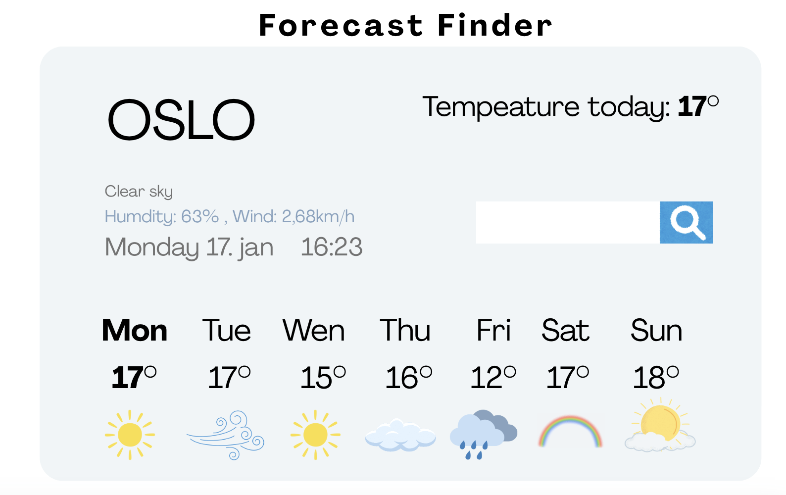

# 🌤️ Forecast Finder

Forecast Finder is a simple weather application that allows users to search for a city and view current weather information, including temperature, humidity and wind, as well as a short forecast.

The project was built as part of the **SheCodes Plus** course, with a focus on clean structure, API integration and user-friendly UI.

---

## ✨ Features

- Search for weather by city name  
- Display current temperature in Celsius  
- Show weather details such as humidity and wind  
- Display a multi-day weather forecast  
- Responsive and clean user interface  

---

## 🧠 Design Process

Before starting the implementation, I created an initial visual mockup in **Canva** to plan the layout, typography and information hierarchy.

The goal of the design was to:
- Keep the interface clean and minimal  
- Make the most important information easy to scan  
- Separate current weather from forecast visually  

### Initial mockup


The final implementation follows this mockup closely, with small adjustments made during development to improve spacing and responsiveness

---

## 🛠️ Technologies Used

- HTML  
- CSS  
- JavaScript (Vanilla)  
- Axios  
- SheCodes Weather API  

---

## 🌍 API

Weather data is fetched from the **SheCodes Weather API**, using Axios to handle HTTP requests.

---

## 🚀 Live Demo

👉  [View the app live](https://forcast-finder-dvld.netlify.app/)

---

## 📂 Project Structure

```text
├── index.html
├── src/
│   ├── style.css
│   └── script.js
├── design/
│   └── forecast-finder-mockup.png
└── README.md
